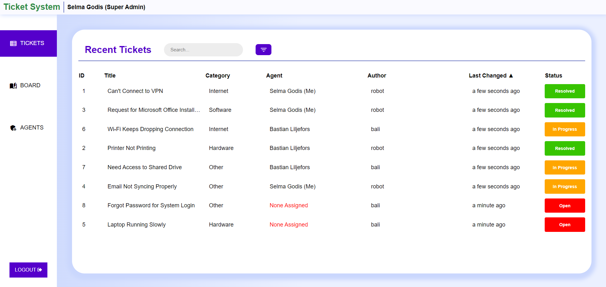
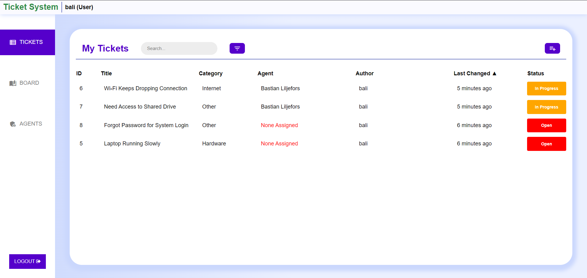

# Ticket System

## Introduction

This IT helpdesk ticketing system is designed to run on a native Linux server, helping organizations efficiently manage and resolve IT issues. Employees can submit tickets for problems they encounter, while IT agents track, claim, and resolve them. The system streamlines communication, allows for ticket management, and includes admin controls for assigning tasks and maintaining balanced workloads.

---

Main view (Agent/Super Admin):


---

Main view (User):


---

## How to Use

### Prerequisites

#### Development Environment:

* Node.js
* Express.js framework
* MariaDB

#### Server Requirements:

* A native Linux server (Ubuntu or similar)
* Necessary software packages (e.g., npm, Git)

#### Auth0:

* An Auth0 account
* Application configured in Auth0 for SSO, including:
    * Callback URL
    * Logout URL
    * API configuration for token management

#### Gmail:

* Gmail account configured for IMAP and NodeMailer, including:
    * 2FA
    * Application password
    * IMAP Access

---

### Build and Setup

1. #### Setting Up the Development Environment

    1. Install Node.js and git
    ```bash
    sudo apt update
    sudo apt install nodejs git npm
    ```

    2. Project Initialization
    ```bash
    git clone <repository-url>
    ```

    3. Install the required pacakges
    ```bash
    cd <project-directory>
    npm install
    ```

2. #### Database Setup

    1. Install MariaDB
    ```bash
    sudo apt install mariadb-server
    ```

    2. Initial Configuration
    ```bash
    sudo mysql_secure_installation
    ```

    Enter the following answers during the setup:

    * Enter current password for root (enter for none): enter
    * Switch to unix_socket authentication? (y/n): n
    * Change the root password? (y/n): n
    * Remove anonymous users? (y/n): y
    * Disallow root login remotely? (y/n): y
    * Remove test database and access to it? (y/n): y
    * Reload privilege tables now? (y/n): y

    3. #### Create User

        1. Log into the MariaDB shell by running the following command
        ```bash
        sudo mysql
        ```

        2. Create a new user and grant privileges
        ```bash
        CREATE DATABASE TicketSystem;
        CREATE USER 'user_name'@'localhost' IDENTIFIED BY 'your_password';
        GRANT ALL PRIVILEGES ON *.* TO 'user_name'@'localhost';
        FLUSH PRIVILEGES;
        EXIT;
        ```

        3. Run the provided SQL script to set up the necessary tables and relationships
        ```bash
        cd sql/
        mysql -u <user_name> -p<your_password> < reset.sql
        ```

3. #### Auth0 Setup

    #### Create an Auth0 Account

    If you don't have an Auth0 account, sign up at Auth0.

    #### Application Configuration

    1. Go to the **Applications > Applications** and create a new application.
        * Select a name for your application.
        * Choose the Regular Web Application type.
        * Select Node.js (Express) as the technology used for the project.
        * Select "I want to integrate with my app".
            * Set Allowed Callback URLs: http://\<server_ip\>:\<port\>/callback
            * Set Allowed Logout URLs: http://\<server_ip\>:\<port\>/login
        * Press next on the rest of the steps, you can ignore these.
    4. Go to **Applications > APIs > Auth0 Management API > Machine To Machine Applications** and make sure your application is authorized. Then, add the following permissions to your application:
        * read:users
        * update:users
        * create:users
        * read:roles
        * update:roles
    5. Go to **Actions > Library** and create a new custom action.

        Name: Add roles to access token.

        Trigger: Login / Post Login.

        Runtime: Node 18 (Recommended).

        Then, add the following code to the action:

        ```bash
        /** 
        * @param {Event} event - Details about the user and the context in which they are logging in. 

        * @param {PostLoginAPI} api - Interface whose methods can be used to change the behavior of the login. 
        */ 
        exports.onExecutePostLogin = async (event, api) => { 
        const namespace = 'https://ticketsystem.com';
            if (event.authorization) { 
                api.idToken.setCustomClaim(`${namespace}/roles`, event.authorization.roles); 
                api.accessToken.setCustomClaim(`${namespace}/roles`, event.authorization.roles); 
            } 
        }
        ```

        Now, deploy the action and add it to the Post Login trigger, between start and complete.
    6. Go to User **Management > Roles** and add three roles:
        * User
        * Agent
        * Super Admin
    7. Go to User **Management > Users** and add a new user with the role Super Agent. You can either add more users and agents under **Management > Users**, or you can use the Super Agent account to log into the Ticket System and add more users and agents that way.

4. #### Gmail Setup

    1. Go to Gmail and create a new account for the Ticket System to use.
    2. Log into Gmail with the new account.
    3. Press the cog on the upper right and then go to **See all settings > Forwarding and POP/IMAP**.
        * Enable IMAP
        * Auto-Explunge on
    4. Go to **Manage your Google Account > Security > 2-Step Verification** and turn on 2-Step Verification.
    5. Search for App passwords, create a new app, and save the generated app password.

5. #### Configuration

    Before running the application, you'll need to update the *config.json* file with your specific settings. Follow these steps to customize each section:

    * Locate the *config.json* file under *\<project-directory>/config/config.json* of your project directory.
    * MariaDB Configuration:
        ```bash
        "MariaDB": {
        "host": "YOUR_MARIADB_HOST_IP",
        "user": "YOUR_DATABASE_USER",
        "password": "YOUR_DATABASE_PASSWORD",
        "database": "TicketSystem"
        }
        ```
        * Replace YOUR_MARIADB_HOST_IP with the IP address of your MariaDB server.
        * Replace YOUR_DATABASE_USER with your database username.
        * Replace YOUR_DATABASE_PASSWORD with your database user's password.

    * Mailer Configuration
        ```bash
        "mailer": {
            "EMAIL_ADDRESS": "YOUR_EMAIL_ADDRESS",
            "APPLICATION_PASSWORD": "YOUR_EMAIL_APP_PASSWORD",
            "HOST": "imap.gmail.com",
            "BYPASS_DOMAIN": "YOUR_BYPASS_DOMAIN",
            "SUPER_ADMIN_MAIL": "YOUR_SUPER_ADMIN_EMAIL"
        }
        ```
        * Replace EMAIL_ADRESS with the email address of the gmail account you created earlier.
        * Replace APPLICATION_PASSWORD with the app password you generated earlier.
        * If emails sent from a specific domain are to have an account created automatically if one doesn't exist, replace YOUR_BYPASS_DOMAIN with that domain (e.g. bth.se). Otherwise, leave this unchanged.
        * Replace YOUR_SUPER_ADMIN_EMAIL with the email address of the super admin user.
    
    * Express Configuration
        ```bash
        "Express": {
            "PORT": YOUR_PORT_NUMBER,
            "MAX_AGE": YOUR_MAX_AGE_IN_MINUTES,
            "SECRET": "YOUR_SESSION_SECRET"
        }
        ```
        * Replace YOUR_PORT_NUMBER with the port number you want the application to listen on.
        * Replace YOUR_MAX_AGE_IN_MINUTES with the maximum age of a session cookie in minutes (recommended is 30 to 60 minutes).
        * Replace YOUR_SESSION_SECRET with a secret key for session management (any string will do, but it's recommended to use a cryptographically secure random string).

    * Auth0 Configuration
        ```bash
        "Auth0": {
            "CLIENT_DOMAIN": "YOUR_AUTH0_DOMAIN",
            "CLIENT_ID": "YOUR_AUTH0_CLIENT_ID",
            "CLIENT_SECRET": "YOUR_AUTH0_CLIENT_SECRET",
            "CALLBACK_URL": "http://<SERVER_IP>:<PORT>/callback",
            "LOGOUT_URL": "http://<SERVER_IP>:<PORT>/login",
            "LOGOUT_REDIRECT_URL": "https://<YOUR_AUTH0_DOMAIN>/v2/logout?returnTo=http://<SERVER_IP>:<PORT>/login&client_id=<YOUR_AUTH0_CLIENT_ID>",
            "USER_ROLE_ID": "YOUR_USER_ROLE_ID",
            "AGENT_ROLE_ID": "YOUR_AGENT_ROLE_ID",
            "SUPER_ADMIN_ROLE_ID": "YOUR_SUPER_ADMIN_ROLE_ID"
        }
        ```
        * Replace YOUR_AUTH0_DOMAIN with your Auth0 domain.
        * Replace YOUR_AUTH0_CLIENT_ID with your Auth0 client ID.
        * Replace YOUR_AUTH0_CLIENT_SECRET with your Auth0 client secret.
        * For CALLBACK_URL, LOGOUT_URL and LOGOUT_REDIRECT_URL, set:
            * <SERVER_IP> to the IP address of your server.
            * <PORT> to the same port number you set for the express server.
        * Replace YOUR_USER_ROLE_ID, YOUR_AGENT_ROLE_ID and YOUR_SUPER_ADMIN_ROLE_ID with the IDs of the corresponding roles in your Auth0 tenant, you can get these by going to **User Management > Roles > User/Agent/Super Admin**.
    
    * Multer Configuration
        ```bash
        "Multer": {
            "MAX_FILE_SIZE_MB": YOUR_MAX_FILE_SIZE_MB,
            "MAX_FILE_AMOUNT": YOUR_MAX_FILE_AMOUNT,
            "ALLOWED_FILE_TYPES": "YOUR_ALLOWED_FILE_TYPES",
            "UPLOADS_DIRECTORY": "YOUR_UPLOADS_DIRECTORY"
        }
        ```
        * Replace YOUR_MAX_FILE_SIZE_MB with the maximum file size in MB.
        *  Replace YOUR_MAX_FILE_AMOUNT with the maximum number of files that can be uploaded at once.
        *  Replace YOUR_ALLOWED_FILE_TYPES with a list of allowed file types separated by | (e.g. "jpeg|jpg|png|pdf").
        *  Replace YOUR_UPLOADS_DIRECTORY with the directory where uploaded files will be stored (if you want to use the default location, set this to *../public/uploads*).

---

### Testing

During the development of this project, all features and functionalities were tested manually to ensure proper operation. Thus, no automated unit or integrations tests exist.

---

### Run
To run the application, navigate to the project directory and run the following command:

```bash
node index.js
```